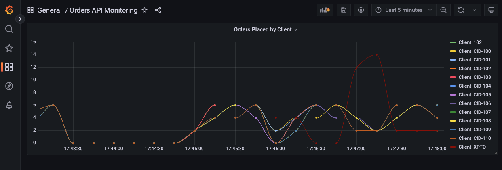

# POC - Spring Boot com Métricas Customizadas

POC para testar métricas customizadas no Spring Boot, scrapping com Prometheus e visualização no Grafana.



## Aplicação

### Dependências

Lib para habilitar métricas com Prometheus:

```xml
<dependency>
	<groupId>io.micrometer</groupId>
	<artifactId>micrometer-registry-prometheus</artifactId>
	<scope>runtime</scope>
</dependency>
```

### API

A API expõe endpoitn para criar pedidos do cliente.

URL: `http://localhost:8080/orders`

Payload:

```json
{
	"clientId": "XPTO",
	"totalAmount": 120.50
}

```

Response:

```json
{
	"orderNumber": 42
}
```

A aplicação expõe a métrica abaixo:

- `orders_placed_total`: total de pedidos criados

### JMeter

O arquivo `jmeter-orders.jmx` contém uma suite configurada para efetuar requisições de forma
aleatória utilizando contador com distribuição Poisson.

A cada requisição gera um payload com `clientId` entre 100 e 110.

Para rodar:

```sh
jmeter -n -t jmeter-orders.jmx
```

## Infraestrutura

Infraestrutura pode ser iniciada utilizado o Docker Compose:

```sh
docker-compose up
```

### Prometheus

O Prometheus está configurado para rodar no Docker.

Acesse o diretório `./prometheus` e rode:

```sh
docker build -t poc-prometheus .

docker run --name prometheus -p 9090:9090 poc-prometheus
```

URL de acesso: `http://localhost:9090/graph`

### Grafana

O Grafana é executado com Docker:

```sh
docker run -d -p 3000:3000 grafana/grafana
```

URL de acesso: `http://localhost:3000/`

Usuário e senha: `admin`.

Configurações:

- Criar um data source com o Prometheus usando a URL `http://prometheus:9090`;
- Criar um dashboard utilizando o data source Prometheus com:
  - Código da métrica: `sum by(client_id) (floor(increase(orders_placed_total[10s])))`
